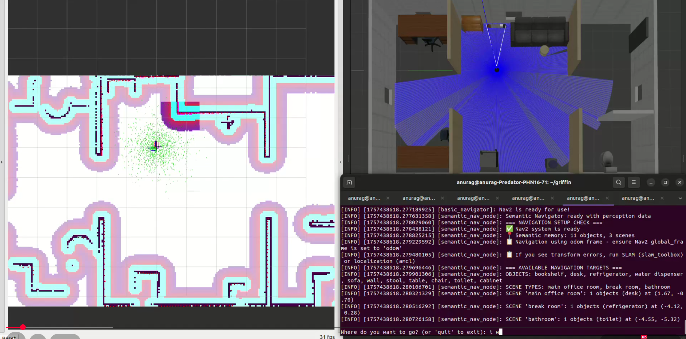

# Semantic Navigation System for TurtleBot3

A comprehensive ROS2 implementation featuring autonomous exploration, custom RRT* path planning, and Vision-Language Model (VLM) based semantic navigation capabilities.

## Overview

This project demonstrates advanced robotic navigation through three integrated components:

1. **Autonomous Exploration & Mapping** - SLAM-based environment discovery
2. **RRT* Path Planning** - Custom optimal path generation algorithm  
3. **Semantic Navigation** - Natural language-driven navigation using YOLO12 + OpenAI Vision API

**World View 1**


**World View 2**


## System Architecture

```
┌─────────────────────┐    ┌──────────────────────┐    ┌─────────────────────┐
│   Exploration       │    │   Path Planning      │    │  Semantic Nav       │
│   (SLAM + explore)  │───▶│   (Custom RRT*)      │───▶│  (VLM + OpenAI)     │
└─────────────────────┘    └──────────────────────┘    └─────────────────────┘
         │                           │                           │
         ▼                           ▼                           ▼
    Map Building              Optimal Paths              Natural Language
```

## Prerequisites

- **Ubuntu 22.04** with **ROS2 Humble**
- **Python 3.10+** with pip
- **Gazebo 11** simulation environment
- **OpenAI API Key** (for semantic understanding)

## Installation

### 1. Workspace Setup

```bash
# Create workspace directory
mkdir -p ~/griffin/src && cd ~/griffin/src

# Ensure you have all required packages:
# - semantic_perception (YOLO12 + OpenAI Vision)
# - semantic_navigation (Natural language nav)
# - TurtleBot-RRT-Star (Custom path planner)
# - m-explore-ros2 (Autonomous exploration)
# - turtlebot3_simulations (Gazebo environments)
```

### 2. Dependencies Installation

#### Python Dependencies
```bash
cd ~/griffin/src
pip install -r requirements.txt
```

#### ROS2 System Packages
```bash
sudo apt update && sudo apt install -y \
    ros-humble-navigation2 \
    ros-humble-nav2-bringup \
    ros-humble-turtlebot3-gazebo \
    ros-humble-slam-toolbox \
    gazebo libgazebo-dev
```

#### API Configuration
```bash
# Set OpenAI API key (required for semantic understanding)
export OPENAI_API_KEY="your-api-key-here"

# Make permanent
echo 'export OPENAI_API_KEY="your-api-key-here"' >> ~/.bashrc
source ~/.bashrc
```

### 3. Gazebo Model Configuration

Choose one method to make office models available to Gazebo:

#### Method A: Environment Variable (Recommended)
```bash
# Temporary (current session)
export GAZEBO_MODEL_PATH=$GAZEBO_MODEL_PATH:~/griffin/src/turtlebot3_simulations/turtlebot3_gazebo/models

# Permanent (add to ~/.bashrc)
echo 'export GAZEBO_MODEL_PATH=$GAZEBO_MODEL_PATH:~/griffin/src/turtlebot3_simulations/turtlebot3_gazebo/models' >> ~/.bashrc
source ~/.bashrc
```

#### Method B: Direct Copy (Alternative)
```bash
mkdir -p ~/.gazebo/models/
cp -r ~/griffin/src/turtlebot3_simulations/turtlebot3_gazebo/models/turtlebot3_office/* ~/.gazebo/models/
```

### 4. Build Workspace

```bash
cd ~/griffin
colcon build --symlink-install
source /opt/ros/humble/setup.bash
source install/setup.bash
```

---

## Usage Guide

### Task 1: Autonomous Exploration & Mapping

**Objective**: Demonstrate SLAM-based autonomous exploration using frontier detection.

#### Launch Simulation Environment
```bash
cd ~/griffin
export TURTLEBOT3_MODEL=burger
source install/setup.bash

# Start Gazebo office world
ros2 launch turtlebot3_gazebo turtlebot3_office.launch.py \
    x_pose:=0.0 y_pose:=0.0 \
    use_sim_time:=true \
    use_rviz:=false \
    headless:=true &

# Launch navigation stack
ros2 launch nav2_bringup navigation_launch.py \
    use_sim_time:=True \
    headless:=False &

# Start SLAM mapping
ros2 launch slam_toolbox online_async_launch.py \
    use_sim_time:=True &

# Open RViz for visualization
ros2 run rviz2 rviz2 -d /opt/ros/humble/share/nav2_bringup/rviz/nav2_default_view.rviz
```

#### Begin Autonomous Exploration
```bash
# In new terminal
source install/setup.bash
ros2 launch explore_lite explore.launch.py
```

https://github.com/user-attachments/assets/c6928ba0-049b-43c7-96e7-5e10fc9fae0d


#### Save Generated Map
```bash
# Once exploration completes
ros2 run nav2_map_server map_saver_cli -f ~/griffin/office_map
```

**Features**:
- Frontier-based exploration algorithm
- Real-time SLAM mapping
- Tuned exploration parameters for thorough coverage

---

### Task 2: RRT* Path Planning

**Objective**: Demonstrate RRT* implementation as a global planner for path generation.

#### Setup Navigation with Custom Planner
```bash
cd ~/griffin
export TURTLEBOT3_MODEL=burger
export NAV2_MAP_PATH=~/griffin/src/turtlebot3_simulations/turtlebot3_gazebo/map/office_map.yaml

source install/setup.bash

# Launch simulation
ros2 launch turtlebot3_gazebo turtlebot3_office.launch.py \
    x_pose:=0.0 y_pose:=0.0 \
    use_sim_time:=true \
    use_rviz:=false \
    headless:=true &

# Navigation with RRT* planner
ros2 launch nav2_bringup navigation_launch.py \
    use_sim_time:=True \
    params_file:=~/griffin/src/TurtleBot-RRT-Star/nav2_params.yaml \
    map:=$NAV2_MAP_PATH &

# Localization
ros2 launch nav2_bringup localization_launch.py \
    use_sim_time:=true \
    map:=$NAV2_MAP_PATH &

# Visualization
ros2 run rviz2 rviz2 -d /opt/ros/humble/share/nav2_bringup/rviz/nav2_default_view.rviz
```

#### What to do
1. **Set Initial Pose**: Use "2D Pose Estimate" in RViz to localize robot
2. **Set Goal**: Use "Nav2 Goal" tool to select destination
3. **Observe**: RRT* algorithm generates optimal path in real-time


https://github.com/user-attachments/assets/2003e0bc-2b82-4b31-bcfe-2ddc07e98714


**About the RRT* Algorithm**:
- Asymptotic optimality (converges to optimal solution)
- Dynamic rewiring for path improvement
- Ball-radius optimization for efficient exploration
- Obstacle avoidance with collision checking
- Smooth path interpolation

---

### Task 3A: Semantic Object Detection

**Objective**: Create semantic understanding of environment using YOLO12 + OpenAI Vision API.

#### Launch Environment for Semantic Mapping
```bash
export TURTLEBOT3_MODEL=burger
source ~/griffin/install/setup.bash

# Start simulation environment
ros2 launch turtlebot3_gazebo turtlebot3_office.launch.py \
    x_pose:=0.0 y_pose:=0.0 \
    use_sim_time:=true \
    use_rviz:=false \
    headless:=true &

# Navigation for movement
ros2 launch nav2_bringup navigation_launch.py \
    use_sim_time:=True \
    headless:=False &

# SLAM for mapping
ros2 launch slam_toolbox online_async_launch.py \
    use_sim_time:=True &

# Visualization
ros2 run rviz2 rviz2 -d /opt/ros/humble/share/nav2_bringup/rviz/nav2_default_view.rviz
```

#### Start Semantic Perception System
```bash
source ~/griffin/install/setup.bash
ros2 run semantic_perception semantic_perception_new
```

#### Monitor Detection Results
```bash
# View annotated images with detections
rqt_image_view
# Select topic: /percep/annotated_image

# Monitor semantic memory updates
watch -n 1 "ls -la ~/griffin/config/"
```

**Objected detected by YOLO and object labelling, scene understanding done by OpenAI**


**Added depth threshold of 3.0m such that detection and labelling is done when nearby objects and not in empty space, while also avoiding calling the OpenAI api continously**


**System Capabilities**:
- **YOLO12**: Fast, accurate object bounding boxes
- **OpenAI Vision API**: Semantic understanding and scene classification  
- **3D Positioning**: RGB-D integration for spatial object mapping
- **Scene Understanding**: Room type classification (office, break room, bathroom)
- **Semantic Memory**: JSON-based object and scene database
- **Visualization**: Annotated image stream with confidence scores


https://github.com/user-attachments/assets/af3816c6-c596-4c95-9822-1a382f3f10e4

---


### Task 3B: Natural Language Navigation

**Objective**: Enable navigation through natural language commands using semantic understanding.

#### Prepare Navigation Environment
```bash
source ~/griffin/install/setup.bash

# Launch simulation
ros2 launch turtlebot3_gazebo turtlebot3_office.launch.py \
    x_pose:=0.0 y_pose:=0.0 \
    use_sim_time:=true \
    use_rviz:=false \
    headless:=true &

# Navigation stack (requires existing map)
ros2 launch nav2_bringup navigation_launch.py \
    use_sim_time:=True \
    map:=$NAV2_MAP_PATH &

# Localization
ros2 launch nav2_bringup localization_launch.py \
    use_sim_time:=true \
    map:=$NAV2_MAP_PATH &

# Visualization
ros2 run rviz2 rviz2 -d /opt/ros/humble/share/nav2_bringup/rviz/nav2_default_view.rviz
```

#### Start Semantic Navigation Interface
```bash
source ~/griffin/install/setup.bash
ros2 run semantic_navigation semantic_nav
```

#### Example Natural Language Commands
```
Where do you want to go?
> "go to the bathroom"
> "find the refrigerator" 
> "navigate to office desk"
> "take me to break room"
```

**Navigation Features**:
- **Natural Language Understanding**: OpenAI-powered query interpretation
- **Object-based Navigation**: Navigate to specific detected objects
- **Scene-based Navigation**: Navigate to room types or areas
- **Semantic Matching**: Intelligent mapping of queries to known locations

[](https://www.youtube.com/watch?v=naMtXU2QUeY)
---

## System Architecture Details

### Semantic Memory Structure

The system creates hierarchical semantic understanding stored in `~/griffin/config/semantic_exploration_memory_*.json`:

```json
{
  "objects": {
    "desk": {
      "positions": [
        {"x": -4.290722597182318, "y": 4.020722006496828, "z": 0.5363367397245207},
        {"x": 1.2533783566743029, "y": 4.446467848692503, "z": 0.5078012384617328}
      ],
      "confidences": [0.31530261039733887, 0.32054540514945984],
      "timestamps": ["2025-09-09T02:45:00.081581", "2025-09-09T02:48:16.697983"],
      "highest_confidence": 0.32054540514945984,
      "best_position": {"x": 1.2533783566743029, "y": 4.446467848692503, "z": 0.5078012384617328}
    },
    "toilet": {
      "positions": [
        {"x": -4.5540686190646475, "y": -5.318418133166253, "z": 0.3767251727878963}
      ],
      "confidences": [0.6012506484985352],
      "timestamps": ["2025-09-09T02:46:18.717737"],
      "highest_confidence": 0.6012506484985352,
      "best_position": {"x": -4.5540686190646475, "y": -5.318418133166253, "z": 0.3767251727878963}
    }
  },
  "scenes": {
    "main office room": {
      "unique_objects": ["desk"],
      "object_count": 1,
      "confidences": [0.9, 0.9, 0.9],
      "timestamps": ["2025-09-09T02:44:49.053022", "2025-09-09T02:45:00.082508"],
      "highest_confidence": 0.9,
      "best_position": {"x": 1.670416908220802, "y": -0.697140892197236, "z": 0.403020038752547}
    },
    "bathroom": {
      "unique_objects": ["toilet"],
      "object_count": 1,
      "confidences": [0.9, 0.9, 0.9, 0.9, 0.9],
      "timestamps": ["2025-09-09T02:46:18.718582", "2025-09-09T02:46:22.300131"],
      "highest_confidence": 0.9,
      "best_position": {"x": -4.5540686190646475, "y": -5.318418133166253, "z": 0.3767251727878963}
    },
    "break room": {
      "unique_objects": ["refrigerator"],
      "object_count": 1,
      "confidences": [0.9, 0.9, 0.9],
      "timestamps": ["2025-09-09T02:45:11.104400", "2025-09-09T02:45:14.301241"],
      "highest_confidence": 0.9,
      "best_position": {"x": -4.120816425208103, "y": 0.2782392357478172, "z": 0.664629745993223}
    }
  },
  "exploration_path": [],
  "session_info": {
    "start_time": "2025-09-09T02:44:25.564805",
    "file_number": "8",
    "node_version": "3.0_scene_center_computed",
    "structure": "objects_and_scenes_with_computed_centers"
  }
}
```

**Memory System:**

- **Multiple Detections**: Each object stores all detection instances with positions, confidences, and timestamps
- **Best Position Selection**: Automatically selects the highest confidence detection as the canonical location
- **Scene Classification**: Automatically infers room types (office, bathroom, break room) based on detected objects
- **Confidence Scoring**: YOLO detection confidence combined with OpenAI Vision API classification scores

### Package Organization

```
griffin/
├── src/
│   ├── semantic_perception/        # YOLO12 + OpenAI perception
│   ├── semantic_navigation/        # Natural language navigation
│   ├── TurtleBot-RRT-Star/         # Custom RRT* implementation
│   ├── m-explore-ros2/             # Frontier exploration
│   ├── turtlebot3_simulations/     # Gazebo environments
│   └── requirements.txt            # Python dependencies
├── config/                         # Generated semantic memory
├── build/                          # Compilation artifacts  
└── install/                        # ROS2 installation
```
---

## References & Acknowledgments

- **Exploration**: [m-explore-ros2](https://github.com/robo-friends/m-explore-ros2) - Frontier-based exploration
- **Path Planning**: [TurtleBot-RRT-Star](https://github.com/mmcza/TurtleBot-RRT-Star) - RRT* algorithm implementation  
- **Object Detection**: [ultralytics](https://github.com/ultralytics/ultralytics) - YOLO12 models
- **Vision Understanding**: [OpenAI Vision API](https://platform.openai.com/docs/guides/vision) - Scene analysis and labeling
- **Simulation**: [TurtleBot3](https://emanual.robotis.com/docs/en/platform/turtlebot3/overview/) - Robot platform and Gazebo integration
